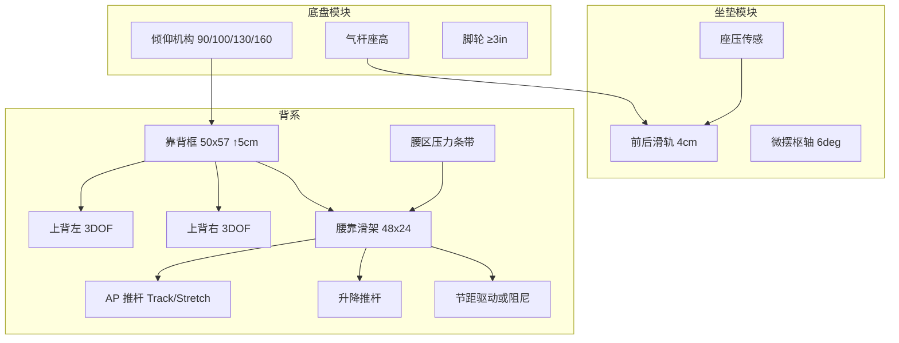

# 合脊 TF-1（TriFlex）机械结构方案与力学分析

> **文档性质：** 概念—工程衔接稿（机构方案 + 静力学估算），**非**实验室实测、**非**认证报告、**非**开模图纸。  
> **对齐：** `docs/chair-product-concept.md` 上传尺寸/行程包络。  
> **标记：** 【假设】【估算】【目标】须在台架与人因试验后替换。

---

## 0. 设计输入（摘自概念稿）

| 项 | 取值 | 来源 |
| --- | --- | --- |
| 适配身高 | 160–185 cm | 上传 |
| 设计承重 | ≤125 kg | 【假设】 |
| 腰靠 | 48×24 cm；↑5 cm；AP 5 cm；±15° | 上传 |
| 上背 | 外包络 50×34 cm；**左/右分块**；每块 ↑5 / AP5 / ±15°（3DOF×2） | 上传+决策 |
| 靠背框 | 50×57 cm；↑5 cm | 上传 |
| 腰–坐初始 | 外缘距 ~42 cm；间隙 ~3 cm | 上传 |
| 坐垫 | 前后 4 cm；微摆 6° | 上传 |
| 扶手 | **4D 纯机械手动**（无电机、不自动；不做 7D） | 产品决策 |
| 倾仰 | 90° / 100° / 130° / 160°（任意锁为目标） | 上传 |
| 座高 | 气杆 45–55 cm | 上传 |
| Track / Stretch | 互斥；Stretch 复用腰靠 AP 推杆，约 4–6 min | 概念 |

**力学分析基准质量：** \(m = 125\,\mathrm{kg}\)，\(W = mg \approx 1226\,\mathrm{N}\)。

---

## 1. 总体机械架构

### 1.1 设计原则

1. **腰靠滑架与上背模块运动解耦**——传感装在腰靠硬背板；**左右上背**扭身/追背不污染腰区力闭环。  
2. **Track / Stretch 分时互斥**——同一 AP 推杆；控制层互锁，Stretch 时**左右上背**锁持或降增益。  
3. **没电可坐**——气杆座高、倾仰、上背被动弹性仍可用；电机轴可手动旁路或自锁丝杠持位。  
4. **力帽优先于行程**——所有主动轴以电流/力传感封顶，再谈跟腰精度。  
5. **扶手定 4D 纯机械**——手动调节；**无电机、不自动**；不做 7D。腰/拉伸的电控按键为臂侧按键，与扶手机构分离。

### 1.2 机构拓扑（侧视示意）

带尺寸 SVG 简图见：**`docs/tf1-mechanism-diagrams.md`**（`media/tf1-*.svg`）。

```
头枕(36×20)──升降柱↑8 / 双轴翻
        │
上背左/右 ── 各 AP5 + 节距±15° + 升降5（3DOF×2）
        │ 挂接
靠背框 50×57 ── 框体升降↑5cm ──┐
        │                      │ 倾仰枢轴 → 底盘同步倾仰
腰靠滑架 ── 竖轨↑5 + AP推杆5cm + 节距±15°
        │ 间隙~3cm
坐垫 ── 前后4cm + 跷跷板±6°
        │
气杆座高 45–55cm / 脚轮≥3" / **4D 纯机械扶手**
```



### 1.3 自由度分配（建议驱动类型）

| 轴 | 行程 | 建议实现 | 备注 |
| --- | --- | --- | --- |
| 腰靠 AP | 50 mm | **梯形丝杠直线推杆**（自锁） | Track 微步 + Stretch 往复复用 |
| 腰靠升降 | 50 mm | 丝杠或齿条 + 自锁 | 入座标定后低频调节 |
| 腰靠节距 | ±15° | 短臂推杆 / 蜗轮 + 限位 | 可与 AP 合成「等效顶腰」 |
| 上背左 / 上背右（各） | ↑5 / AP5 / ±15° | **优先：受控弹性+阻尼+硬限位** 落入 3DOF 包络；电机化每侧最多 3 轴 | 左右独立扭身；Stretch 时锁定 |
| 靠背框升降 | 50 mm | 手动棘轮或电机 | 适配身高两端 |
| 坐垫前后 | 40 mm | 手动滑轨锁定 | — |
| 坐垫微摆 | 6° | 枢轴 + 橡胶限位 | 跟倾仰或独立 |
| 扶手 | 4D | **纯机械手动**成熟模组 | **无电机、不自动**；不做 7D |
| 倾仰 | 四档 + 任意锁目标 | 同步倾仰 + 扭簧包 | MVP 先做可靠四档 |

---

## 2. 关键模块详细结构

### 2.1 腰靠滑架（核心机芯）

**结构分层（由后向前）：**

1. **背框挂板**——与靠背框用竖向燕尾/圆导轨连接（升降 5 cm）。  
2. **升降滑座**——承载 AP 导轨副；升降推杆两端球头防偏载。  
3. **AP 滑台**——双直线导轨（建议轨距竖向 ≥120 mm），推杆居中。  
4. **节距摇板**——腰垫硬背板铰接于滑台，±15° 机械硬限位。  
5. **软垫 + 压力传感条带**——2–4 区；传感在硬背与泡沫之间。

**材料【假设】：** 滑座 ADC12 / PA66-GF；导轨钢；硬背板铝合金或玻纤板。

**干涉与安全：**

- 与坐垫间隙维持 ~3 cm（初始）；AP 全出时校核腘窝/骨盆下缘。  
- 侧向护翼避免夹手；导轨加防尘罩。  
- Stretch 过流、离座、倾仰>130° 时禁启动（与概念状态机一致）。

### 2.2 上背动态模块（左右分块，每块 3DOF）

**几何：** 外包络约 500×340 mm；中缝分开为左/右两块（单块宽约 **240 mm**【假设】）。

**每块 3 自由度（已定）：**

| DOF | 行程 | 说明 |
| --- | --- | --- |
| 升降 | 50 mm | 相对靠背框 |
| 前后 AP | 50 mm | 追肩胛/扭身 |
| 节距 | ±15° | 前后仰角包络 |

**推荐实现（基线）：** 每块用 **弹性扭杆/层合弹簧 + 阻尼 + 硬限位** 实现上述包络（扭身时左右自然非对称），**不默认 6 个电机**。  
**可选电机化：** 每侧最多 3 轴；Stretch / 大躺时锁定。中缝加防夹胶条与最小间隙【假设 ≥8–10 mm】。

**载荷：** 左右合计仍按原上背分担；非对称扭身时单侧可瞬时更高 → 单侧限位与疲劳按 **1.3× 均分载荷**【假设】校核。

### 2.3 倾仰与底盘

- 同步倾仰：坐垫随背框后移，减小腿压。  
- 扭簧包按用户体重可调；档位棘轮 90/100/130/160°。  
- 任意角锁【目标】：摩擦盘或液压锁，成本单列，MVP 可砍。

### 2.4 坐垫微摆 6°

- 左右横向枢轴（前后跷跷板）或前后枢轴（左右倾）——概念稿为跷跷板式，建议 **左右轴、前后俯仰 ±6°**。  
- 橡胶块限位 + 可选锁定销（打字时锁死）。

---

## 3. 载荷工况定义

| 工况 ID | 描述 | 座/背分载【假设】 | 用途 |
| --- | --- | --- | --- |
| LC1 正坐办公 | 倾仰 90–100° | 座 85% / 背 15% | Track、上背弹簧 |
| LC2 大躺 | 倾仰 160° | 座 45% / 背 55% | 框、倾仰枢轴、销轴 |
| LC3 Track 强档 | 正坐 + 腰接触力 120 N | — | AP 推杆持续 |
| LC4 Stretch 峰值 | 正坐 + 腰接触力帽 **180 N**【假设】 | — | 推杆、导轨弯矩 |
| LC5 误用侧向 | 背框侧向 250 N【假设】 | — | 框抗扭 |
| LC6 参考耐久 | 座静载 ~1350 N、背水平 ~667 N（BIFMA 量级参考） | — | **仅作目标参照，非宣称已通过** |

数值（\(W=1226\,\mathrm{N}\)）：

| 工况 | \(F_\mathrm{seat}\) | \(F_\mathrm{back}\) |
| --- | --- | --- |
| LC1 | ≈1042 N | ≈184 N |
| LC2 | ≈552 N | ≈674 N |

---

## 4. 腰靠机芯力学分析

### 4.1 自由体与力平衡（AP 轴）

接触合力 \(F_c\) 近似沿腰靠法向。推杆效率 \(\eta \approx 0.75\)【假设】（减速箱+丝杠链路），最大节距 \(\alpha=15^\circ\)：

\[
F_\mathrm{act} \approx \frac{F_c}{\eta\cos\alpha}
\]

| 模式 | \(F_c\)【假设】 | \(F_\mathrm{act}\)【估算】 |
| --- | --- | --- |
| Track 轻 | 40 N | ≈55 N |
| Track 中 | 80 N | ≈110 N |
| Track 强 | 120 N | ≈166 N |
| Stretch 力帽 | **180 N** | ≈**249 N** |

**选型建议：** AP 直线推杆额定连续 ≥**300 N**，峰值 ≥**400 N**（含冲击与老化余量）。

### 4.2 丝杠扭矩与电机【估算】

梯形丝杠导程 \(p=2\,\mathrm{mm}\)，丝杠效率 \(\eta_s=0.35\)【假设】：

\[
T_\mathrm{screw} = \frac{F_\mathrm{act}\,p}{2\pi\eta_s}
\]

| 工况 | \(T_\mathrm{screw}\) |
| --- | --- | --- |
| Track 强 | ≈0.15 N·m |
| Stretch 峰值 | ≈0.23 N·m |

经 10:1 减速后电机侧更小，但实机摩擦、偏载、低温油脂会使需求上浮。**工程建议：** 输出端（丝杠后）可用扭矩按 **0.8–1.2 N·m** 量级选减速电机，或直接采购 **额定 300 N 级** 直线推杆模组，以力帽电流标定为准，不以纸面扭矩卡死。

### 4.3 升降轴

滑架自重【假设】≈1.2 kg；AP 预紧引起的导轨摩擦按 \(0.3 F_c\) 计：

\[
F_h \approx 1.2g + 0.3\times 180 \approx 66\,\mathrm{N}
\]

升降推杆额定 **≥100 N** 即可；重点在自锁与两端限位开关。

### 4.4 节距轴力矩

接触点相对节距铰偏心 \(e=30\,\mathrm{mm}\)【假设】：

\[
M_p = F_c\,e \xrightarrow{F_c=180\,\mathrm{N}} 5.4\,\mathrm{N\cdot m}
\]

若节距推杆力臂 40 mm：\(F_p\approx 135\,\mathrm{N}\)。可与 AP 合成控制，MVP 可用 **弹簧复位 + 阻尼 + 硬限位** 省电机。

### 4.5 导轨偏载

AP 全伸时接触力相对导轨平面悬臂 \(L_c\approx 80\,\mathrm{mm}\)【假设】，轨距 \(s=120\,\mathrm{mm}\)：

\[
M_\mathrm{rail}=F_c L_c,\quad F_\mathrm{couple}\approx M_\mathrm{rail}/s \approx 120\,\mathrm{N}
\]

双轨直线导轨（或镶铜滑套）按此弯矩选型；禁止单杆悬臂硬顶。

### 4.6 Stretch 功耗量级【估算】

往复功（平均力按 \(0.7 F_c\)，行程 50 mm，一来一回）：

\[
W_\mathrm{cyc}\approx 2\times 0.7\times 180\times 0.05 \approx 12.6\,\mathrm{J}
\]

若周期 4 s、持续 5 min ≈75 次：机械功 ≈0.95 kJ；机电总效率 50% 时约 **0.5 Wh** 量级——电池压力主要在 **Track 待机电流与多轴保持**，不在单次 Stretch。

---

## 5. 上背与靠背框

### 5.1 上背载荷

| 工况 | 上背分担【假设】 | \(F_\mathrm{upper}\) |
| --- | --- | --- |
| LC1 | 背载的 60% | ≈110 N |
| LC2 | 背载的 55% | ≈371 N |

MVP 弹簧：在 25 mm 挠度承担 LC1 力，\(k\approx F/0.025\approx 4.4\,\mathrm{kN/m}\)【估算】。大躺时靠 **硬限位+框结构** 吃掉 LC2，避免弹簧过硬影响扭身。

### 5.2 靠背框与倾仰枢轴

背载合力作用点到倾仰枢轴距离 \(L_b\approx 0.45\,\mathrm{m}\)【假设】：

\[
M_\mathrm{rec}(\mathrm{LC2})\approx 674\times 0.45 \approx 304\,\mathrm{N\cdot m}
\]

- **扭簧包 / 同步机构** 按 ≥**350–400 N·m** 设计峰值扭矩（含冲击 SF）。  
- 若用短力臂（80 mm）拉杆平衡，杆力可达 ~3.8 kN——**不推荐过短力臂**；宜加大力臂或改扭簧，使杆力落在 **1–2 kN** 级紧固件可管理范围。  
- 枢轴销：按剪切许用 ~80 MPa、SF≈3，直径建议 **≥12–14 mm** 调质钢销（LC2 及误用组合校核后定稿）。

---

## 6. 坐垫、气杆、脚轮

| 部件 | 控制载荷【估算】 | 要点 |
| --- | --- | --- |
| 坐垫泡沫/盘 | LC1 ≈1042 N；耐久参照 ~1350 N | 前后滑轨锁定抗剪 |
| 气杆 | 座+椅上质量；行程支撑 45–55 cm 座高 | 选 BIFMA/国标气杆规格档 |
| 五星脚 | 倾覆：侧向推+大躺 | 铝合金/尼龙按承重 125 kg+冲击 |
| 脚轮 | ≥3" 双轮；单轮垂直力 ≈整椅/5 + 动载 | 透明橡胶，防地板压痕试验 |

整椅自重概念约 28–35 kg【假设】→ 地面对五脚约 **0.4–0.45 kN** 静载均分，滚动与卡布需单独测。

---

## 7. 强度、刚度、疲劳（设计准则）

| 项目 | 建议准则【目标】 |
| --- | --- |
| 静强度 SF | 金属屈服 ≥1.5（正常）；误用 ≥1.2 |
| 刚度 | Track 持位：腰靠法向刚度在死区外可辨；整背在 LC1 下肩胛处挠度目标 &lt;8–10 mm【待试坐】 |
| Stretch 疲劳 | AP 模组 ≥**2×10⁴** 全行程往复（约合数年日用）【目标】 |
| Track 微动 | ≥**10⁶** 小步（短行程）【目标】 |
| 倾仰棘轮 | ≥**10⁵** 次档位切换【目标】 |
| 噪音 | 与概念稿一致：Track ≤35 dB(A)@1 m；Stretch ≤45–50（目标，非实测） |

**失效模式优先序：** 导轨卡死夹手 &gt; 丝杠磨损失自锁 &gt; 传感漂移误顶 &gt; 框疲劳裂纹。

---

## 8. 电控—机构接口（力学相关）

| 传感 | 用途 |
| --- | --- |
| 座压 | 入座使能；离座停机 |
| 腰区 2–4 区压力 | Track 误差；力帽冗余 |
| 推杆电流 | 力估计、堵转 |
| 端点霍尔/微动 | 软硬限位 |
| 倾仰角 | &gt;130° 降增益；160° 持位 |

力帽标定：工装测力计映射电流—\(F_c\) 曲线，分轻/中/强三档；Stretch 硬顶 **180 N**【假设待人因确认】**不可**当医疗牵引。

---

## 9. 原型台架与验证顺序

1. **腰靠单独台架：** 5 cm AP / 5 cm 升降 / ±15°；测 \(F_c\)–电流、噪音、寿命。  
2. **导轨偏载：** 全伸 + 180 N 偏心，测滑隙与温升。  
3. **上背弹簧：** LC1 贴合、LC2 限位不塑性。  
4. **倾仰枢轴：** 304 N·m 静载 + 冲击；销轴应变片可选。  
5. **系统互锁：** Track⊥Stretch；大躺禁 Stretch。  
6. **人因：** 160 / 172 / 185 cm × 轻中强档；记录不可接受顶腰。  
7. **几何检具：** 42 cm / 3 cm + 坐垫滑 4 cm。

通过门禁：急停可靠；无不可接受夹伤风险；两端身高无持续压迫；头枕 AP（TBD）闭合前不做背框量产开模。

---

## 10. 风险与开放项

| 风险 | 影响 | 缓解 |
| --- | --- | --- |
| 双动态耦合 | 左右上背振荡、顶肩、中缝夹手 | 弹性基线；Stretch 锁左右上背；中缝防夹 |
| 短力臂倾仰杆力过大 | 紧固件疲劳 | 扭簧为主，拉杆力臂加大 |
| 180 N 力帽不适 | 用户拒止 | 人因下调至 120–150 N |
| 头枕 AP TBD | 两端身高失效 | 工装扫参后再定 |
| 自锁失效 | Stretch 回弹 | 梯形丝杠 + 断电制动 |

---

## 11. 与概念稿/竞品机构对照

| | Omni 电动 | X7 | **TF-1 本方案** |
| --- | --- | --- | --- |
| 腰托 | 按键电机 AP≈50 mm | 传感追腰 + 机芯按摩 | 传感闭环 + **同轴 Stretch**，无机芯 |
| 背 | FlexFit 被动面板 | 常规背+护翼 | **左右上背各 3DOF** + 腰滑架解耦；扶手 **4D 纯机械** |
| 力学重点 | 推杆与电池 | 按摩模组可靠性 | **导轨偏载 + 倾仰力矩 + 力帽** |

---

## 12. 假设汇总（须被实测替换）

- 承重 125 kg；座背分载 85/15 与 45/55。  
- Track 40/80/120 N；Stretch 力帽 180 N。  
- \(\eta=0.75\)，丝杠 \(\eta_s=0.35\)，导程 2 mm。  
- 节距偏心 30 mm；导轨悬臂 80 mm；轨距 120 mm。  
- 上背分担比例；弹簧 \(k\) 与倾仰力臂几何。  
- 疲劳次数与 dB 目标。

*力学稿修订：2026-09-23 · 上背左右分块各 3DOF；扶手 **4D 纯机械***
